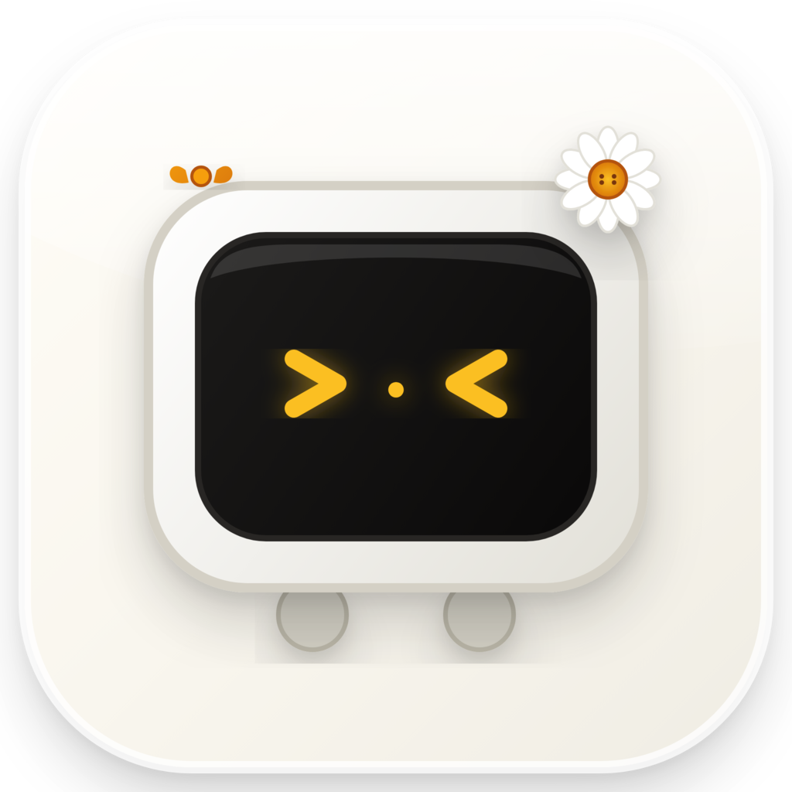
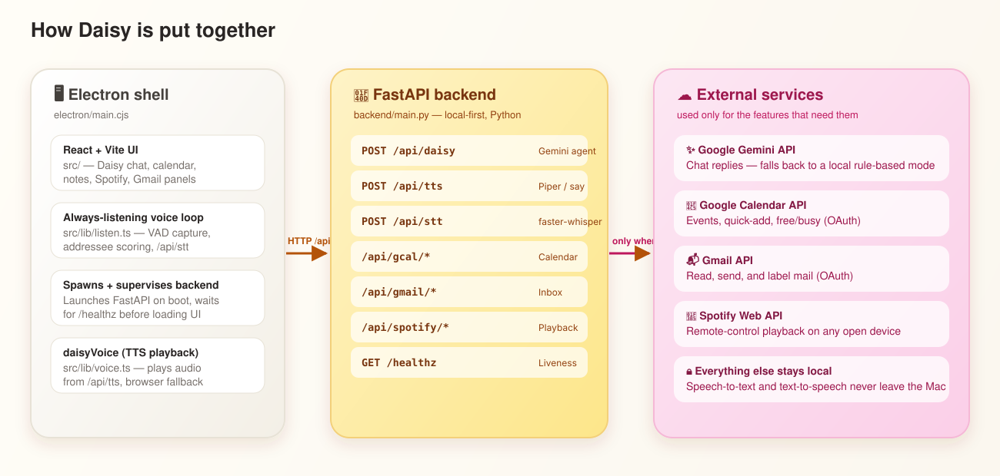

<div align="center">


<br />



### A premium, local-first personal hub — voice assistant, calendar, music, notes, and inbox in one desktop app.

[](#prerequisites)
[](https://www.electronjs.org/)
[](https://react.dev/)
[](https://www.typescriptlang.org/)
[](https://fastapi.tiangolo.com/)
[](https://www.python.org/)
[](https://ai.google.dev/)

</div>

---

Daisy is a desktop app that puts a warm, capable AI assistant at the center of
a daily workspace — chat with her by typing or by voice, and she can check
your calendar, control Spotify, read and send email, and keep notes, all
without you touching a menu. Speech recognition and speech synthesis run
**entirely on your machine**; nothing you say is sent anywhere unless you ask
Daisy to do something that needs the network (like a chat reply from Gemini,
or a calendar / email / Spotify action).

## ✨ Features

| | |
|---|---|
| 🎙️ **Voice-first** | Always-listening mic with **no wake word** — an on-device scorer works out whether you were talking to Daisy or to someone else in the room. Local speech-to-text (faster-whisper) + text-to-speech (Piper). |
| 💬 **AI chat agent** | Conversational assistant powered by Google Gemini, with a local rule-based fallback if the API is unavailable. |
| 📅 **Calendar** | Full Google Calendar integration — view, create, move, and RSVP to events, all from chat or the calendar tab. |
| 🎵 **Music** | Spotify Connect remote control — search, queue, play/pause/skip, and control whichever device is already open. |
| 📬 **Inbox** | Read, send, and triage Gmail without leaving the app. |
| 📝 **Notes** | A fast, local notes and checklist workspace. |
| 🖥️ **Native desktop app** | Packaged with Electron for macOS, Windows, and Linux; ships with a bundled backend so end users never install Python. |

## 🏗️ Architecture

<div align="center">

</div>

- **Frontend** — React 19 + Vite (`src/`), Tailwind CSS.
- **Backend** — FastAPI (`backend/main.py`), a single local-first Python
  service that exposes:

  | Route | Purpose |
  |---|---|
  | `POST /api/daisy` | Daisy's chat agent (Google Gemini, with an offline fallback) |
  | `POST /api/tts` | Local neural text-to-speech (Piper, `say` fallback) |
  | `POST /api/stt` | Local speech-to-text (faster-whisper) |
  | `/api/gcal/*` | Google Calendar (OAuth) |
  | `/api/gmail/*` | Gmail (shares the Calendar OAuth session) |
  | `/api/spotify/*` | Spotify Connect remote control |
  | `GET /healthz` | Liveness probe, used by Electron to know the backend is up |

  In production it also serves the built frontend (`dist/`) as static files.
- **Electron** (`electron/main.cjs`) — launches the FastAPI backend on
  startup, waits until `/healthz` responds, then loads the UI.
  - **Dev**: loads the Vite dev server (`:3000`), which proxies `/api` → the
    backend (`:8000`).
  - **Prod**: loads a packaged backend executable bundled into the app, which
    serves the static UI + API from one process.

## 🚀 Getting started

### Prerequisites

- **Node.js** 18+
- **Python 3.10+** (`python3` on your `PATH`)
- macOS, Windows, or Linux (voice mode has been tuned on macOS)

### Setup

```bash
# 1. Install Node dependencies
npm install

# 2. Set up the Python backend — creates backend/.venv, installs deps, and
#    downloads the local TTS/STT models (Piper ~61MB, Whisper ~150–1500MB
#    depending on size) into backend/voices/ and backend/whisper-model/
npm run backend:setup

# 3. Configure integrations (all optional)
cp .env.example .env
```

Then fill in whichever keys in `.env` you want — see
[Environment variables](#-environment-variables) below. Every integration
degrades gracefully when its keys are missing, including all of them.

### Run

| Command | What it does |
|---|---|
| `npm run electron:dev` | **Recommended.** Starts Vite, then Electron, which spawns the backend automatically. |
| `npm run backend:dev` | FastAPI only, on `http://127.0.0.1:8000` with auto-reload. |
| `npm run dev` | Vite only, on `http://localhost:3000` (proxies `/api` → the backend). |
| `npm run start` | Production-style: builds the UI, serves UI + API from FastAPI on `:8000`, no Electron. |

## 🎙️ Voice mode

Click the mic in the title bar and just talk — **there is no wake word**. Say
"play some jazz" and it plays.

1. Daisy continuously monitors the mic and detects when you start/stop
   speaking with a noise-floor-adaptive VAD — no push-to-talk.
2. Once you go quiet, the utterance is transcribed locally via `/api/stt`
   — audio never leaves the machine. On Apple Silicon this runs Whisper
   `large-v3-turbo` on the **GPU** via `mlx-whisper` (~0.5s for a typical
   utterance); everywhere else it falls back to `faster-whisper` on the CPU.
3. Every transcript is scored on-device by
   [`src/lib/addressing.ts`](src/lib/addressing.ts) to work out whether it was
   aimed at Daisy or at whoever else is in the room (see below).
4. If it was for her, it goes to Gemini like any typed message and she speaks
   the reply via `/api/tts` (Piper).

### Telling you apart from your friends

Dropping the wake word means the mic hears your conversations too, so the
addressee decision runs in two stages:

| Verdict | What it looks like | What happens |
|---|---|---|
| **Ignore** | "did you see what she posted", "yeah that place was packed", "hey Mark, grab the door" | Dropped **on your machine**. Never sent anywhere. |
| **Address** | "play some jazz", "what's on my calendar", "turn it down a bit" | Acted on immediately. |
| **Unsure** | "put that on", "the second one" | Only these are sent to the model, which can reply `notForMe` and stay silent. |

The scorer weighs signals like third-person subjects and reported speech
("he said…") against capability verbs and self-data questions ("what's on
*my* calendar"). It's deliberately biased toward silence: a wrong "ignore"
means you repeat yourself, a wrong "address" means Daisy talks over your
friend. If Gemini is unreachable, an unsure utterance resolves to silence
rather than guessing.

**Saying "Daisy" still works** and overrides the scorer outright — it's the
deliberate escape hatch when she misses you, just no longer required.

After she replies, Gemini returns a `listenAfter` flag deciding whether the
exchange is still open. While it is, the bar drops so bare follow-ups ("the
second one", "yeah do that") land without any keywords — but utterances with
strong room-conversation signals are still ignored, so a live window can't
drag in the next thing you say to someone else.

She pauses listening while she's talking, so she never transcribes her own
voice. The mic preference persists across restarts, and speech models are
warmed in the background at startup so the first reply is snappy. The mic
button's tooltip shows the last addressee verdict and which signals fired.

### Speech recognition engines

| | Engine | Model | Latency¹ | WER¹ |
|---|---|---|---|---|
| **Apple Silicon** (default) | `mlx-whisper` (GPU) | `large-v3-turbo` | **0.46s** | **4.6%** |
| Everywhere else | `faster-whisper` (CPU) | `base.en` | ~2–3s | — |

¹ Measured on an M5 over 20 clips — 10 phrases from Daisy's command vocabulary
× near/far-field, where far-field adds attenuation, noise and reverb to
approximate a laptop mic across a room.

Full `large-v3` (0.72s / 6.1%) and the English-only `distil-large-v3`
(0.67s / 6.1%) were both benchmarked and are **slower *and* less accurate**
than turbo — bigger is not better here.

**English is enforced on the output.** `large-v3-turbo` is a multilingual
model, and `language="en"` only biases decoding — it does not restrict which
alphabet the decoder may emit, so on non-speech input it occasionally returns
another script entirely (60Hz mains hum produced `"окiem question."`). Any
segment containing a non-Latin script is therefore discarded before it reaches
the app. Accented Latin (`café`, `résumé`) is unaffected.

Override with env vars: `DAISY_STT_ENGINE=mlx|faster-whisper` to force an
engine, `MLX_WHISPER_MODEL` / `WHISPER_MODEL` to change models, and
`WHISPER_PROMPT` to change the decoder bias vocabulary.

## 🔑 Environment variables

See [`.env.example`](.env.example) for the full, commented list. Summary:

| Variable | Enables | Get it from |
|---|---|---|
| `GEMINI_API_KEY`, `GEMINI_MODEL` | Daisy's AI chat replies | [Google AI Studio](https://aistudio.google.com/apikey) |
| `GOOGLE_CLIENT_ID`, `GOOGLE_CLIENT_SECRET` | Calendar **and** Gmail (one OAuth connection) | [Google Cloud Console](https://console.cloud.google.com/apis/credentials) |
| `SPOTIFY_CLIENT_ID` | Spotify Connect playback control | [Spotify Developer Dashboard](https://developer.spotify.com/dashboard) |

### Where Daisy looks for them

`.env` is read from three places, later ones winning:

1. the project root — how you configure a **development** checkout
2. next to the backend executable inside the app bundle
3. a **per-user config directory**, which is how you configure an installed app:

   | Platform | Path |
   |---|---|
   | macOS | `~/Library/Application Support/Daisy/.env` |
   | Windows | `%APPDATA%\Daisy\.env` |
   | Linux | `$XDG_CONFIG_HOME/Daisy/.env` (default `~/.config/Daisy/.env`) |

Installers deliberately **do not** bundle a `.env` — shipping one would hand
whoever built the release their own API keys. Every integration is optional, so
an app with no `.env` at all still runs; it just has less to talk about.

## 📁 Project structure

```
Daisy/
├─ src/                    React frontend
│  ├─ components/          Chat, calendar, notes, Spotify, Gmail panels
│  └─ lib/                 listen.ts (voice capture), voice.ts (TTS playback),
│                           gcal.ts, gmail.ts, spotify.ts (API clients)
├─ backend/                FastAPI service
│  ├─ main.py               Daisy agent, TTS, STT, static hosting
│  ├─ gcal.py / gmail.py    Google OAuth + Calendar/Gmail routes
│  └─ spotify.py            Spotify OAuth + playback routes
├─ electron/                Main process + preload (window chrome, backend
│                            supervision, IPC bridge)
└─ scripts/                 Backend packaging (PyInstaller) + icon rendering
```

## 📦 Packaging the desktop app

| Command | Output |
|---|---|
| `npm run backend:build` | Standalone backend executable (PyInstaller) → `backend/dist/daisy-backend` |
| `npm run electron:build` | Builds the UI and packages an installer (dmg/nsis/AppImage) → `release/` |
| `npm run electron:pack` | Unpacked app directory for a quick local smoke test, no installer |

The packaged app ships with a bundled backend executable and the built
frontend, so end users never need Python installed.

## 🧪 Testing

| Command | Runs |
|---|---|
| `npm run test` | Frontend unit tests (Vitest) — addressee scoring, WAV encoding, user-name storage |
| `npm run lint` | TypeScript type-checking across the frontend |
| `npm run backend:test` | Backend unit tests (pytest) — API routes, transcript cleanup, health checks |

## 🚀 Releasing

Releases are cut by tagging — GitHub Actions does the rest:

```bash
npm version 0.1.0        # bumps package.json and creates the v0.1.0 tag
git push --follow-tags
```

[`release.yml`](.github/workflows/release.yml) then runs the test suites, and
only if they pass builds installers on macOS, Windows and Linux runners in
parallel and uploads them to a **draft** GitHub release. Review the draft and
publish it when you're happy. The workflow refuses to build if the tag and
`package.json` version disagree, so a release can't be mislabelled.

`workflow_dispatch` runs the same build without publishing, which is the way to
test a change to the pipeline without spending a version number on it.

> **Builds are unsigned.** macOS Gatekeeper reports an unsigned download as
> *"Daisy is damaged and can't be opened"*, which reads as malware but only
> means it isn't notarized. Until the build is signed with an Apple Developer
> certificate, users need to run `xattr -cr /Applications/Daisy.app` once, or
> right-click the app and choose *Open*.

## 📄 License

Released under the [MIT License](LICENSE).

---

<div align="center">
<sub>Built with 🌼 for a calmer desktop.</sub>
</div>
